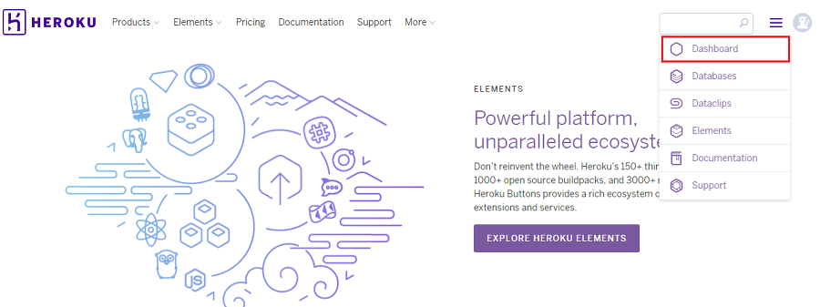
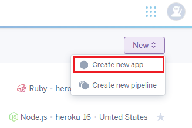
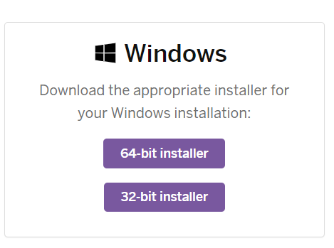

[Heroku로 무료로 배포하기]

Heroku로 간단한 서비스 배포하기


## Heroku 배포하기

#### 1 . 앱 생성

- 회원가입 후 로그인 하여, 우측 상단에서 `Dashboard` 클릭

  

- `Create new app`을 클릭한다.

  

- App name 항목에 URL에 표기할 이름을 영어로 작성합니다.

  예를 들어, App name으로 victolee라고 작성했으면, 배포할 사이트의 주소는 다음과 같습니다.

  *https://victolee.herokuapp.com/*


#### 2. Heroku CLI 설치

- [Getting Started](https://devcenter.heroku.com/articles/getting-started-with-nodejs#set-up)에서 CLI를 설치한다.

  

#### 3) heroku 계정의 이메일과 비밀번호를 입력

- Heroku cli를 다운로드 했기 때문에, Heroku 명령어를 커맨더 창에서 사용할 수 있습니다.

- 커맨더 창에서 heroku login 명령어를 입력하고 허로쿠 계정의 이메일과 비밀번호를 입력해주세요.


#### 4) heroku에 배포

```
# cd 프로젝트 위치
# git init
# git add .
# git commit -m "heroku test"

# 1번에서 생성한 앱 이름
# heroku git:remote -a app name\

# git push heroku master

# heroku ps:scale web=1
```


#### 5) 코드 변경시 새로 배포

```
# git push heroku master

# 나같은 경우는 dev 브랜치를 위주로 사용했는데 다음과 같이 입력하면 된다.
# git push heroku HEAD:master
```


출처 : https://victorydntmd.tistory.com/112